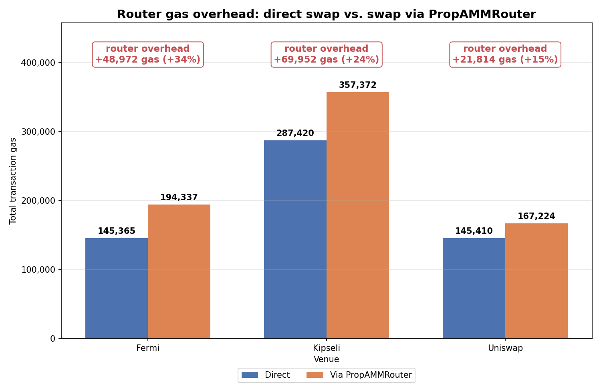
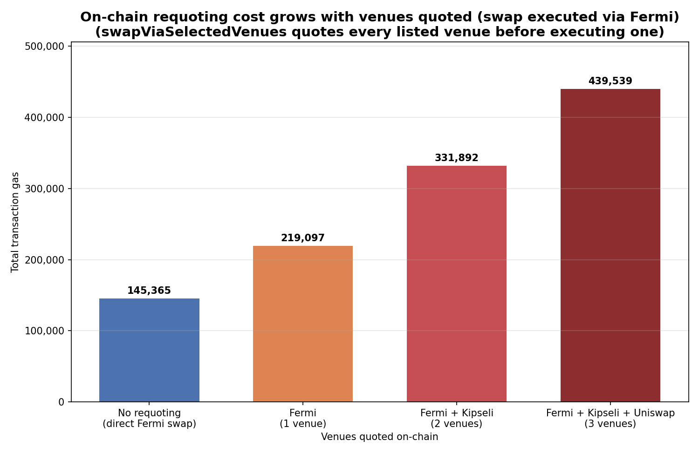

# PropAMMRouter Gas Overhead Report

Gas costs of swapping through the **PropAMMRouter**, covering two sources of overhead:

1. The router itself, vs. swapping directly against a venue.
2. On-chain requoting, when `swapViaSelectedVenues` quotes every venue before executing.

All totals are the root-frame gas from each flamegraph, scaled to match the on-chain
receipt `gasUsed` (i.e. the value Etherscan shows).

## 1. Router gas overhead

Cost of routing a swap through the PropAMMRouter vs. hitting the venue directly,
for the same swap on each venue.

| Venue   | Direct (gas) | Via PropAMMRouter (gas) | Overhead (gas) | Overhead (%) |
|---------|-------------:|------------------------:|---------------:|-------------:|
| Fermi   |      145,365 |                 194,337 |        +48,972 |       +33.7% |
| Kipseli |      287,420 |                 357,372 |        +69,952 |       +24.3% |
| Uniswap |      145,410 |                 167,224 |        +21,814 |       +15.0% |

The router adds ~22k–70k gas on top of the underlying swap. Part of this overhead comes
from the extra ERC-20 transfer the router performs to move the input tokens into the
PropAMM before the swap — a cost a direct swap avoids.

Flamegraphs (open interactively via raw.githack.com):
[Fermi direct](https://raw.githack.com/lambdaclass/propamm-router-contracts/gas-router-overhead/docs/flamegraphs/swap_Fermi_direct.svg) ·
[Fermi via router](https://raw.githack.com/lambdaclass/propamm-router-contracts/gas-router-overhead/docs/flamegraphs/swapViaVenue_Fermi.svg) ·
[Kipseli direct](https://raw.githack.com/lambdaclass/propamm-router-contracts/gas-router-overhead/docs/flamegraphs/swap_Kipseli_direct.svg) ·
[Kipseli via router](https://raw.githack.com/lambdaclass/propamm-router-contracts/gas-router-overhead/docs/flamegraphs/swapViaVenue_Kipseli.svg) ·
[Uniswap direct](https://raw.githack.com/lambdaclass/propamm-router-contracts/gas-router-overhead/docs/flamegraphs/swap_Uniswap_direct.svg) ·
[Uniswap via router](https://raw.githack.com/lambdaclass/propamm-router-contracts/gas-router-overhead/docs/flamegraphs/swapViaVenue_Uniswap.svg)

## 2. On-chain requoting overhead

`swapViaSelectedVenues` quotes **every** venue in the passed list on-chain before
executing the swap on the chosen one. Each additional venue in the list adds one
on-chain quote, so gas grows with the number of venues quoted.

All rows execute the swap via Fermi; only the number of venues quoted on-chain changes.

| Venues quoted                     | Gas     | Δ vs. previous |
|-----------------------------------|--------:|---------------:|
| None (direct Fermi swap)          | 145,365 | —              |
| Fermi (1)                         | 219,097 | +73,732        |
| Fermi + Kipseli (2)               | 331,892 | +112,795       |
| Fermi + Kipseli + Uniswap (3)     | 439,539 | +107,647       |

Each additional venue quoted adds ~73k–113k gas, and that quote's result is discarded
if it doesn't win. If callers can quote off-chain and pass the winning venue to
`swapViaVenue`, they avoid paying for the discarded quotes.

Flamegraphs (open interactively via raw.githack.com):
[swapViaSelectedVenues([Fermi])](https://raw.githack.com/lambdaclass/propamm-router-contracts/gas-router-overhead/docs/flamegraphs/swapViaSelectedVenues_Fermi.svg) ·
[swapViaSelectedVenues([Kipseli,Fermi])](https://raw.githack.com/lambdaclass/propamm-router-contracts/gas-router-overhead/docs/flamegraphs/swapViaSelectedVenues_Kipseli_Fermi.svg) ·
[swapViaSelectedVenues([Kipseli,Fermi,Uniswap])](https://raw.githack.com/lambdaclass/propamm-router-contracts/gas-router-overhead/docs/flamegraphs/swapViaSelectedVenues_Kipseli_Fermi_Uniswap.svg)
